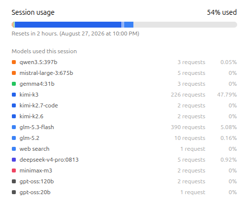
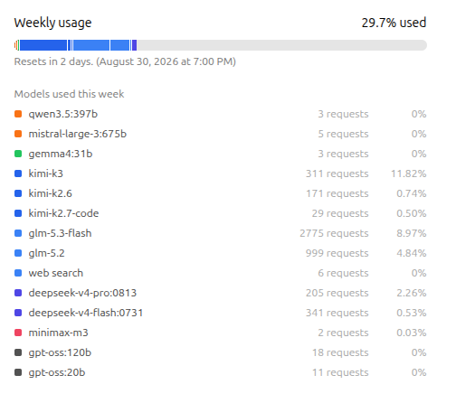

# Ollama Usage Breakdown

A Tampermonkey userscript that makes the usage meters on [ollama.com/settings](https://ollama.com/settings) actually readable, with a per-model breakdown of your Ollama Cloud usage.

 

> También disponible en español: [README.es.md](./README.es.md)

> This userscript is generated and updated with AI assistance. It is not affiliated with or endorsed by Ollama. See the [full disclaimer](#disclaimer-ai-generated) below.

## What it does

- **Session breakdown.** Adds a "Models used this session" list below the session meter, styled exactly like Ollama's native "Models used this week" list (colored dot, model name, request count) plus one extra column.
- **Per-model percentages.** Ollama only reports the overall "X% used" and the request counts. Each model's share exists only in the page HTML, encoded as bar segment widths. The script reads those widths, rescales them against the overall usage, and shows how much of your total limit each model consumed. Together they add up to the X% Ollama reports (e.g. `84.2%` of a `10.7%` session → `9.01%`).
- **Weekly percentages too.** Injects the same rescaled percentage into Ollama's native "Models used this week" list.
- **Exact reset times.** Appends the absolute date and time next to each relative reset, e.g. "Resets in 2 hours. (August 27, 2026 at 2:00 AM)".
- **Dark mode toggle.** A floating button in the bottom-right corner (hover it to see it's from this script) switches any ollama.com page to a dark theme matched to Ollama's own palette, from search filters and model tags to form fields (the site is light-only). It stays off until you enable it, so nothing changes for anyone who only wants the meters; the choice persists across pages and visits.
- Survives htmx updates and SPA navigation, and cleans up after itself when you leave the settings page.

## Installation

1. Install [Tampermonkey](https://www.tampermonkey.net/) in your browser.
2. Open the raw script: <https://raw.githubusercontent.com/srnoob2570/ollama-usage-breakdown/main/ollama-usage-breakdown.user.js>
3. Tampermonkey will offer to install it. Then visit <https://ollama.com/settings>.

### Manual

Open the Tampermonkey dashboard, create a new script, and paste in the contents of [`ollama-usage-breakdown.user.js`](./ollama-usage-breakdown.user.js). Save, then visit <https://ollama.com/settings>.

## Notes

- Percentages are read from Ollama's page (bar segment widths), not from a private API. If Ollama changes its markup, the script may need an update.
- The usage features only appear on `https://ollama.com/settings` (exact URL, not on `/settings/keys`, `/settings/billing` or `/settings/profile`); the theme toggle works across ollama.com. No special permissions (`@grant none`).
- The dark theme is opt-in: off until you enable it with the toggle button, remembered in localStorage across pages and browser sessions.

## Security

This script runs in your browser, so you should never have to trust it blindly:

- One readable file: [`ollama-usage-breakdown.user.js`](./ollama-usage-breakdown.user.js) — no build step, no obfuscation, no dependencies.
- No privileged userscript APIs (`@grant none`): no cross-origin requests, no access to other tabs, the clipboard, or Tampermonkey storage. Everything it displays is parsed from the page's own DOM.
- Runs only on `https://ollama.com/*` and only reads what those pages already show you.
- Every push and pull request is scanned automatically with [CodeQL](https://github.com/srnoob2570/ollama-usage-breakdown/security/code-scanning) using GitHub's security queries.

The badges above don't prove the absence of malware — no badge can. Read the script before installing it, and check the diff Tampermonkey shows on every update.

## Disclaimer: AI-generated

This userscript is written and maintained with the help of AI. It is not affiliated with, endorsed by, or connected to Ollama in any way.

- The AI writes it and a human reviews it before each release. Both can be wrong, so it may still contain bugs or break when Ollama changes its website.
- Use it at your own risk, and always review a userscript before installing it.
- Issues and pull requests are welcome, including fixes for anything the AI got wrong.